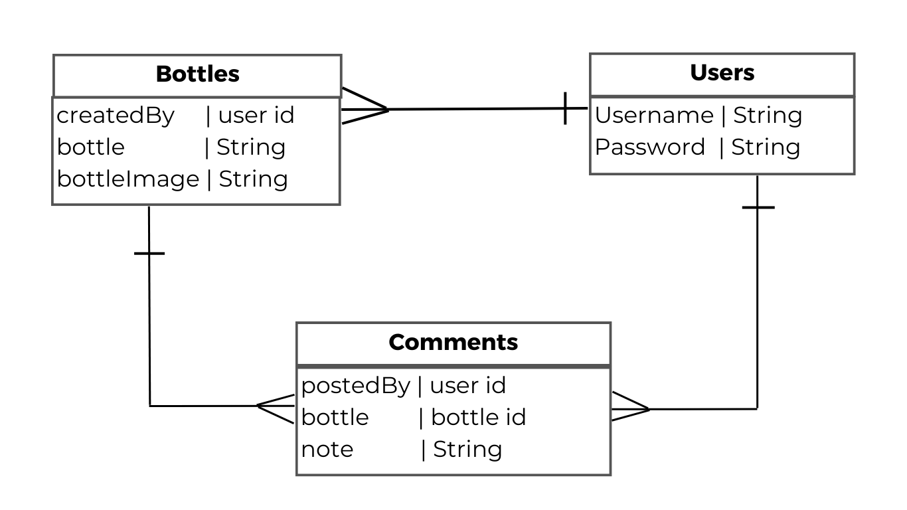

# Bottlekeep

Bottlekeep is a full-stack application that allows users to keep track of their "keep" bottles at various restaurants/bars/lounges.

### Link

TBC

### Technologies
- html
- css
- javascript
- express
- node
- mongodb
- mongoose
- morgan
- dotenv
- liquid
- bootstrap

## User Stories

```
As a user, I want the ability to: 
- sign up for an account.
- sign in to my account.
- sign out of my account.
- create a new bottle.
- keep track of how long a location will hold a bottle.
- keep track of when I purchased a bottle.
- keep track of how much is left in my bottle. 
- share a bottle with a group of users. 
- view all of my bottles. 
- update a bottle.
- delete a bottle I have created. 
- post a comment on a bottle.
- delete comments I have made.
- view a bottle's comments.
```

## Models

```
Bottle: {
    name: {
        type: String,
        required: true
    },
    location: {
        type: String,
        required: true
    },
    datePurchased: {
        type: Date,
        required: true
    },
    holdingTime: Number,
    holdingExpiration: Date,
    volumeRemaining: Number,
    sharing: Boolean,
    sharedWith: [String]
}

User: {
    username: {
        type: String,
        required: true,
        unique: true
    },
    password: {
        type: String,
        required: true
    }
}
```

## Routes

### Bottles

| **URL**           | **Method** | **Action** |
|-------------------|------------|------------|
| /bottles/         | GET        | index
| /bottles/:id      | GET        | show
| /bottles/new      | GET        | new
| /bottles          | POST       | create
| /bottles/:id/edit | GET        | edit
| /bottles/:id      | PATCH/PUT  | update
| /bottles/:id      | DELETE     | destroy

### Comments

| **URL**                               | **Method** | **Action** |
|---------------------------------------|------------|------------|
| /comments/:bottleId                   | POST       | create
| /comments/delete/:bottleId/:commentId | DELETE     | destroy

### Users

| **URL**       | **Method** | **Action** |
|---------------|------------|------------|
| /users/signup | GET        | new
| /users/signup | POST       | create
| /users/login  | GET        | login
| /users/login  | POST       | create
| /users/logout | DELETE     | destroy

## Wireframes


## Entity Relationship Diagrams
